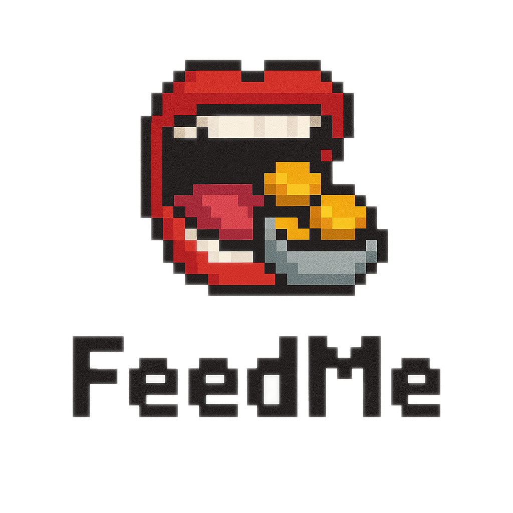

<h4 align="center">
  <a href="https://sloths-warsaw.vercel.app/">Website</a> |
  <a href="https://github.com/degenesis-feed/backend">Backend Repo</a> |
  <a href="https://github.com/degenesis-feed/frontend">Frontend Repo</a>
  

    
  

</h4>

🍽️ FeedMe is the fun and social platform that helps you keep track of what your frens have been up to on chain as of lately! Get a nice currated list, either by the people you follow, or our suggested for you page, or by specific communities! If you see an interesting transaction you'd like to mimic, then just hit the "Copy Action" - button. 

- 💃 **Onchain identity**: Upon registration, you can alternatively use [Self Protocol](https://self.xyz/) to verifyably make your profile unique and use this to join communities!
- 🧹 **Onchain data, cleaned up**: Onchain data is messy and difficult to go through. Thanks to the powerfull tech behind [Nodit](https://nodit.io), we managed to parse it for you!
- 🔎 **See something you like? Copy it!**: Mad your degen friends don't handhold you like they used to? Now you can copy their actions with just one press, powered by [Curvegrid](https://www.curvegrid.com)
- 💅 **Be a star**: Have your impressive onchain degen-ness shown to the world in a new, fun and social way. Flex on your friends and enemys with your big brain moves!

## Bounties 😎

### 💪 Nodit - Nodit-Powered Apps on Base
We're using Nodit to query and parse the blockchain for the data we want to serve our users. We're really thankful for the Nodit team for really taking their time and help us with our weird request, even to the extent of finding out clever hacks on their own API. Great yapping in the meanwhile was certainly a plus.

### 🏆 Curvegrid - Best Overall Use of MultiBaas
Curvegrid is the backbone of our project and thanks to the very versatile API and tooling of MultiBaas, we're able to do seamless copytrading on whatever onchain interaction, as long as the contract is verified. Working with the API was very smooth, and the only issue we ran into was a bit of confusion regarding the chain part of the API url when working with base, which we got help by the Curvegrid team to solve smoothly.

### 💻 Self Protocol - Best Self offchain SDK Integration
Communities are created using Self Protocol, and can be categorized by anything from nationality, age or gender. Implementing the SDK was simple and straightforward, and we where happy to receive great support whenever needed.

## Links

- [Vercel](https://sloths-warsaw.vercel.app/)
- [Github](https://github.com/degenesis-feed)

## Team

- [0xjsi.eth](https://x.com/0xjsieth)
- [Akhil](https://x.com/akhilnanavati)
- [Lasse](https://x.com/VitalikButerin)